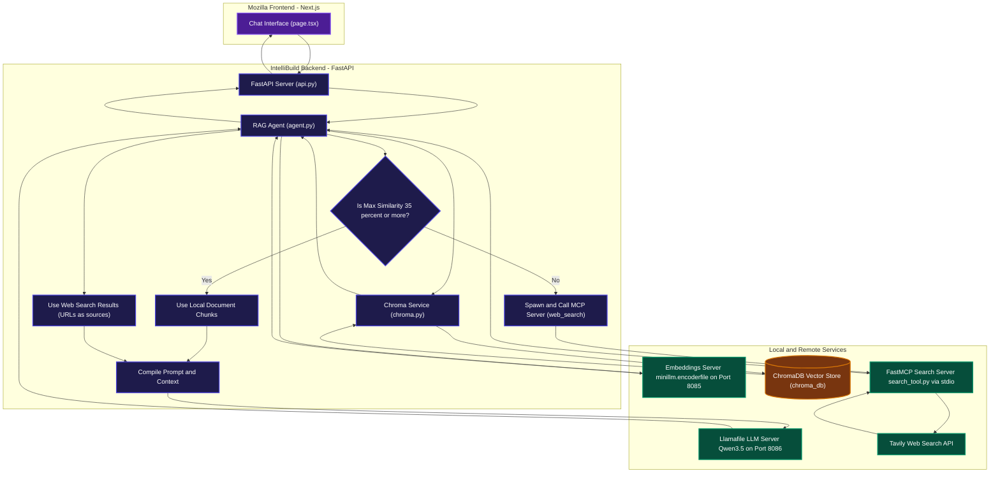

# IntelliBuild - Local RAG Workspace with Direct FastMCP Fallback

IntelliBuild is a Retrieval-Augmented Generation (RAG) system built on local AI services. It lets users upload local documents (PDFs, Markdown, text files), indexes them into a local vector store (ChromaDB), and enables natural-language Q&A using a local LLM. 

When retrieval confidence from local documents is low, the backend automatically initiates a fallback web search using a subprocess-spawner connected to a FastMCP search server (`search_tool.py`), querying the Tavily Search API. Web references are displayed as clickable hyperlinks in the user interface.

---

## System Architecture

Below is the 3D isometric representation of the RAG system architecture:


---

## Detailed Data Flow

The following Mermaid diagram outlines the step-by-step query processing flow:



---

## Web Search Fallback Engine (Direct FastMCP)

Rather than running through `mcpd`, the RAG agent directly controls the lifecycle of the search tool subprocess:
1. When ChromaDB returns document chunks, their cosine distances are parsed into true cosine similarities in the range `[0, 1]`:
   $$\text{similarity} = 1.0 - \text{distance}$$
2. If the maximum similarity score falls below **`0.35`** (or if the database is empty), a low-confidence state triggers.
3. The agent spawns the `search_tool.py` subprocess via standard I/O (using python `mcp` SDK's `stdio_client` and `ClientSession`), executing the `web_search` tool.
4. The retrieved search content is injected directly as the grounded context for the local LLM.

---

## Local Setup and Running

### 1. Requirements
- Python `>= 3.14`
- `uv` package manager

### 2. Configure Environment
Create a `.env` file in the root directory:
```env
TAVILY_API_KEY=your-api-key-here
```

### 3. Launch Embeddings Server
Start the local embeddings server on port `8085`:
```bash
./minillm.encoderfile serve --http-port 8085
```

### 4. Launch LLM Server
Start the llamafile server on port `8086`:
```bash
./Qwen3.5-0.8B-Q8_0.llamafile --server --port 8086
```

### 5. Start Backend Server
Run the FastAPI application:
```bash
uv run api.py
```

### 6. Start Frontend App
Navigate to the Next.js frontend directory and launch the server:
```bash
cd frontend/mozilla-frontend
npm run dev
# or
bun run dev
```
Access the application dashboard at `http://localhost:3000`.
